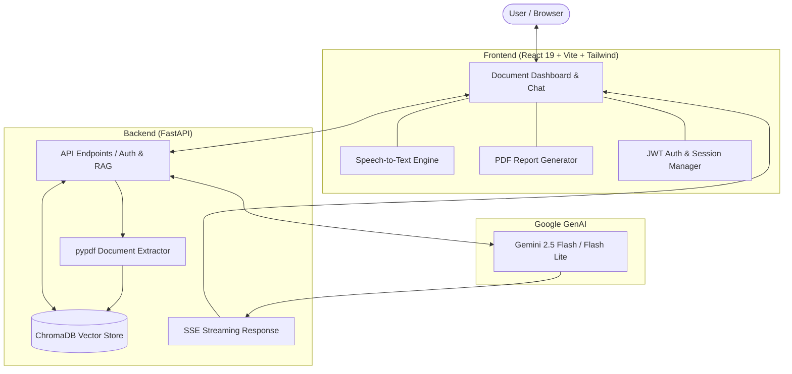

# 📄 DocAnalyst

<div align="center">


**An intelligent, multi-document RAG assistant powered by Google Gemini, ChromaDB, FastAPI, and React.**

[](https://fastapi.tiangolo.com/)
[](https://react.dev/)
[](https://vitejs.dev/)
[](https://ai.google.dev/)
[](https://www.trychroma.com/)
[](https://tailwindcss.com/)
[](LICENSE)

</div>

---

## 🌟 Overview

**DocAnalyst** turns complex documents and lengthy PDF files into interactive conversations. By leveraging local vector embeddings, hybrid semantic retrieval, and Google's latest Gemini models, DocAnalyst extracts key insights, generates executive summaries, proposes intelligent questions, and streams word-by-word answers in real-time.

Whether analyzing technical whitepapers, financial statements, research articles, or legal agreements, DocAnalyst delivers fast, accurate, citation-backed answers with zero guesswork.

---

## ✨ Key Features

- 🧠 **Context-Aware Semantic RAG**: Ingests PDFs into local chunked vector stores via ChromaDB's ONNX embeddings. Queries retrieve the exact paragraphs relevant to your prompt.
- ⚡ **Real-Time Token Streaming**: Server-Sent Events (SSE) stream responses instantaneously from Gemini directly to the user interface.
- 🎙️ **Voice Querying (Speech-to-Text)**: Ask questions hands-free using browser-native speech recognition.
- 📑 **Instant Executive Summary**: Automatically synthesizes a concise, structured 3–5 sentence overview upon document upload.
- 💡 **AI Suggested Questions**: Automatically formulates 4 insightful starter prompts tailored to the uploaded PDF.
- 📚 **Multi-Document Library**: Index multiple PDFs simultaneously, switch between documents on the fly, and maintain persistent per-document conversation histories.
- 📄 **Export Conversation to PDF**: Export your complete Q&A sessions and document findings into downloadable, formatted PDF reports using `jspdf`.
- 🔒 **Secure User Authentication**: Complete JWT-based auth cycle (Registration & Login) with Bcrypt password hashing to keep user sessions isolated.
- 🎨 **Modern Dark Glassmorphic UI**: Sleek, responsive user interface built with React 19, Tailwind CSS, Lucide icons, and smooth micro-interactions.

---

## 🏗️ System Architecture



---

## 📁 Repository Structure

```text
DocAnalyst/
├── backend/
│   ├── auth.py              # JWT authentication & user credential store
│   ├── main.py              # FastAPI application server & route handlers
│   ├── rag_pipeline.py      # PDF parsing, ChromaDB indexing, and Gemini integration
│   ├── requirements.txt     # Python backend dependencies
│   ├── .env.example         # Backend environment variables template
│   └── README.md            # Backend-specific documentation
├── frontend/
│   ├── public/              # Static public assets
│   ├── src/
│   │   ├── assets/          # Component styles & imagery
│   │   ├── App.jsx          # Primary DocAnalyst application & dashboard
│   │   ├── App.css          # Core custom application styling
│   │   ├── index.css        # Tailwind CSS imports & global design tokens
│   │   └── main.jsx         # React application entry point
│   ├── index.html           # HTML5 document template
│   ├── package.json         # NPM dependencies & build scripts
│   ├── vite.config.js       # Vite build & development configuration
│   ├── tailwind.config.js   # Tailwind CSS configuration
│   └── README.md            # Frontend-specific documentation
├── .env.example             # Project-level environment template
├── .gitignore               # Excludes secrets, venvs, DBs, and dependencies
├── LICENSE                  # MIT Open Source License
└── README.md                # Project documentation
```

---

## 🚀 Quick Start Guide

### Prerequisites

Ensure you have the following installed on your machine:
- **Python 3.10+**
- **Node.js 18+** & **npm**
- **Google Gemini API Key** (Get free at [Google AI Studio](https://aistudio.google.com/app/apikey))

---

### 1. Clone the Repository

```bash
git clone https://github.com/kevintennison12-alt/DocAnalyst.git
cd DocAnalyst
```

---

### 2. Configure Environment Variables

Create a `.env` file in the project root:

```bash
cp .env.example .env
```

Open `.env` and supply your Gemini API key:

```env
GOOGLE_API_KEY=your_gemini_api_key_here
JWT_SECRET=super_secret_jwt_key_here
```

---

### 3. Backend Setup

Open a terminal and navigate to the `backend` directory:

```bash
cd backend

# Create and activate a virtual environment
# Windows:
python -m venv venv
venv\Scripts\activate

# macOS / Linux:
# python3 -m venv venv
# source venv/bin/activate

# Install dependencies
pip install -r requirements.txt

# Start the FastAPI server
uvicorn main:app --reload --port 8000
```

The backend server will run at: **`http://localhost:8000`**  
Interactive Swagger API docs available at: **`http://localhost:8000/docs`**

---

### 4. Frontend Setup

Open a separate terminal window and navigate to the `frontend` directory:

```bash
cd frontend

# Install Node dependencies
npm install

# Start the Vite development server
npm run dev
```

Open your browser at **`http://localhost:5173`** to access DocAnalyst!

---

## 🔌 API Reference

| Method | Endpoint | Auth | Description |
|---|---|---|---|
| `POST` | `/register` | No | Register a new user account |
| `POST` | `/login` | No | Authenticate user credentials & receive JWT token |
| `POST` | `/upload` | Bearer | Upload and index a PDF document, extract summary & questions |
| `POST` | `/query` | Bearer | Query the active indexed document (JSON response) |
| `POST` | `/stream` | Bearer | Query the active indexed document with SSE real-time streaming |
| `DELETE` | `/document/{filename}` | Bearer | Remove indexed document from ChromaDB vector store and disk |

---

## 🛡️ Security & Privacy

- **Data Privacy**: Your documents are processed locally for chunking and embeddings using ChromaDB's ONNX model. Only retrieved context chunks are transmitted to Gemini API during question-answering.
- **Zero Committed Secrets**: `.env` and environment variables are strictly ignored in `.gitignore`.
- **Isolated Storage**: Uploaded files and vector indices are maintained in local runtime storage and excluded from source control.

---

## 🛠️ Tech Stack Details

| Component | Technology | Role |
|---|---|---|
| **Frontend Framework** | React 19 + Vite | High-performance single page application |
| **Styling** | Tailwind CSS v4 + Vanilla CSS | Responsive, modern dark-mode aesthetic |
| **Icons & UI** | Lucide React | Clean, scalable interface iconography |
| **Report Generation** | jsPDF | Client-side export of chats to downloadable PDF |
| **Backend API** | FastAPI + Uvicorn | Asynchronous Python REST and SSE API server |
| **LLM Provider** | Google GenAI SDK | Multi-model fallback (`gemini-2.5-flash`, `gemini-flash-latest`) |
| **Embeddings & Vector DB** | ChromaDB (Persistent) | Local ONNX-based text embeddings and similarity search |
| **PDF Extraction** | PyPDF | Fast text parsing and page-aware chunking |
| **Authentication** | Python-JOSE + Passlib | JWT bearer token security and bcrypt encryption |

---

## 🤝 Contributing

Contributions are welcome! If you'd like to improve DocAnalyst:

1. Fork the Project
2. Create your Feature Branch (`git checkout -b feature/AmazingFeature`)
3. Commit your Changes (`git commit -m 'feat: Add AmazingFeature'`)
4. Push to the Branch (`git push origin feature/AmazingFeature`)
5. Open a Pull Request

---

## 📄 License

Distributed under the MIT License. See [`LICENSE`](LICENSE) for more details.

---

<div align="center">
  <sub>Built with ❤️ by <a href="https://github.com/kevintennison12-alt">Kevin Tennison</a></sub>
</div>
